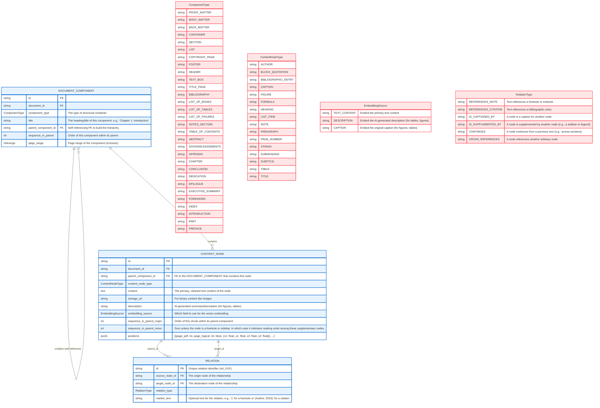

# PDF Parsing Eval

In this repository, I will evaluate the performance of different tools and workflows for parsing PDFs for RAG.

I have a particular schema I want to coerce the data into. Eventually I will likely train a model to convert PDFs to this schema in a single step, but for now I expect to need a multi-step workflow to achieve what I want.

I will first create some ideal human-prepared data for a few PDF pages (extracted with `qpdf dl_001.pdf --pages dl_001.pdf --range=1-5 -- output.pdf`), and then I will use cosine similarity on outputs from various open-source and commercial tools to see which ones are best suited for my use case.

## Schema

