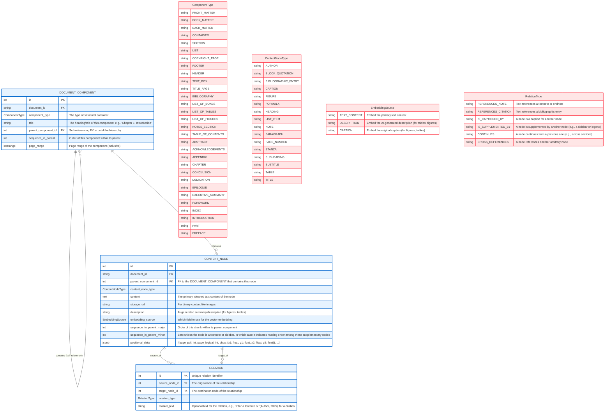
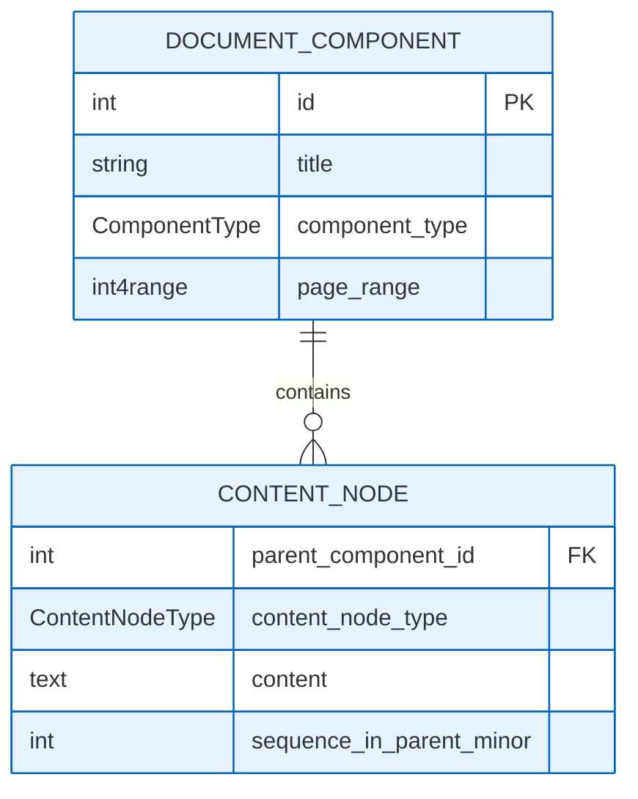
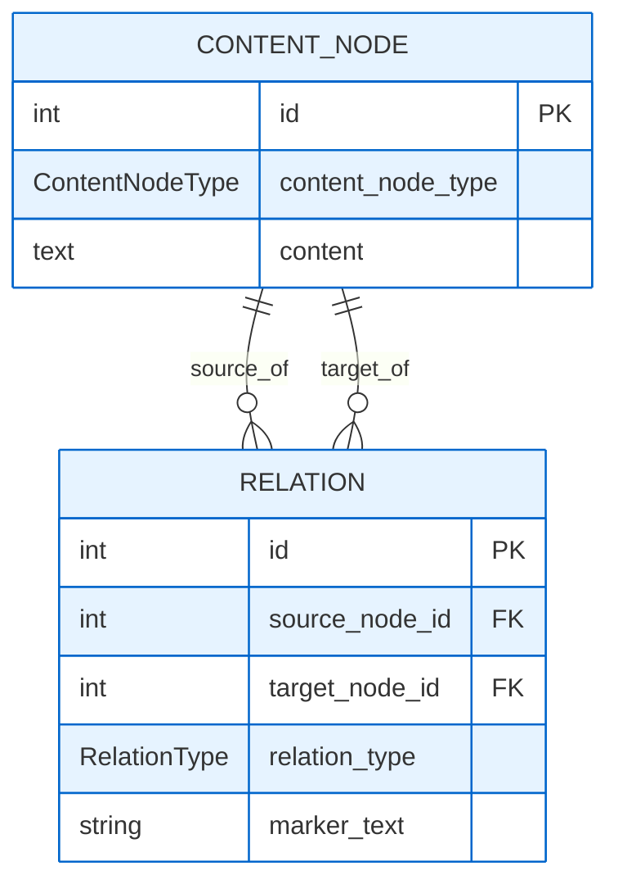

# PDF Parsing Eval

In this repository, I will evaluate the performance of different tools and workflows for parsing PDFs for RAG.

I have a particular schema I want to coerce the data into. Eventually I will likely train a model to convert PDFs to this schema in a single step, but for now I expect to need a multi-step workflow to achieve what I want.

I will first create some ideal human-prepared data for a few PDF pages (extracted with `qpdf dl_001.pdf --pages dl_001.pdf --range=1-5 -- output.pdf`), and then I will use cosine similarity on outputs from various open-source and commercial tools to see which ones are best suited for my use case.

## Schema

The master schema below represents the final, normalized data model we aim to produce. The data is generated through a multi-stage process detailed in the following section.



## Staged Data Generation Workflow

We use a three-stage workflow to transform a raw PDF into the structured data defined in the master schema. Each stage builds upon the last, progressively adding detail and structure.

### Stage 1: Hierarchical Component Generation

In the first stage, an LLM analyzes the PDF to identify the main structural components and their hierarchical relationships. The output is a nested structure that captures the document's outline.

```mermaid
erDiagram
    DOCUMENT_COMPONENT ||--o{ DOCUMENT_COMPONENT : "nests"

    DOCUMENT_COMPONENT {
        ComponentType component_type
        string title nullable
        DOCUMENT_COMPONENT[] children
        int4range page_range "Two-element array representing the inclusive page range of the component, e.g., [1, 10]"
    }

    %% ===== CSS STYLING =====
    classDef enumType fill:#ffe6e6,stroke:#ff4757
    classDef mainTable fill:#e6f3ff,stroke:#0066cc

    class ComponentType enumType
    class DOCUMENT_COMPONENT mainTable
```

### Stage 2: Content Node Mapping

The nested structure from Stage 1 is programmatically flattened, and temporary IDs are assigned to each component. A second LLM pass then reads the PDF content and maps text, figures, tables, and other content nodes to their parent components using these IDs.



### Stage 3: Relation Annotation

Finally, temporary IDs are generated for all content nodes. A third LLM pass identifies non-hierarchical relationships between these nodes, such as footnote references, citations, and cross-references, creating the final `RELATION` entities.


